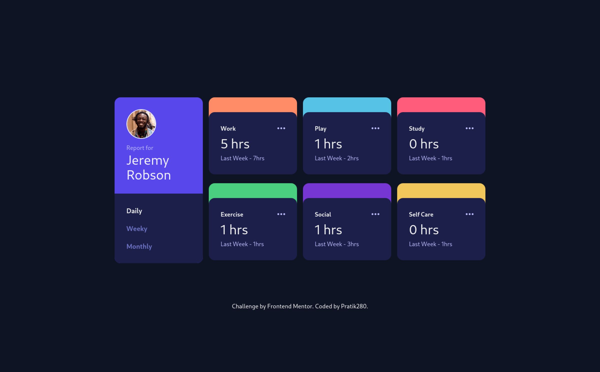

# Frontend Mentor - Time tracking dashboard solution

This is a solution to the [Time tracking dashboard challenge on Frontend Mentor](https://www.frontendmentor.io/challenges/time-tracking-dashboard-UIQ7167Jw). Frontend Mentor challenges help you improve your coding skills by building realistic projects. 

## Table of contents

- [Overview](#overview)
  - [Links](#links)
  - [The challenge](#the-challenge)
  - [Screenshot](#screenshot)
- [My process](#my-process)
  - [Built with](#built-with)
- [Author](#author)

## Overview

### Links

- Source Code (Gihtub): [https://github.com/Pratik280/time-tracking-dashboard](https://github.com/Pratik280/time-tracking-dashboard)
- Live Site URL (Github Pages): [https://pratik280.github.io/time-tracking-dashboard/](https://pratik280.github.io/time-tracking-dashboard/)
 
### The challenge

Users should be able to:

- View the optimal layout for the site depending on their device's screen size
- See hover states for all interactive elements on the page
- Switch between viewing Daily, Weekly, and Monthly stats
 
### Screenshot

## My process

### Built with

- Semantic HTML5 markup
- [tailwindcss](https://tailwindcss.com/)
- Flexbox
- CSS Grid
- Mobile-first workflow
- Vanilla JS

## Author

- Frontend Mentor - [@Pratik280](https://www.frontendmentor.io/profile/Pratik280)
